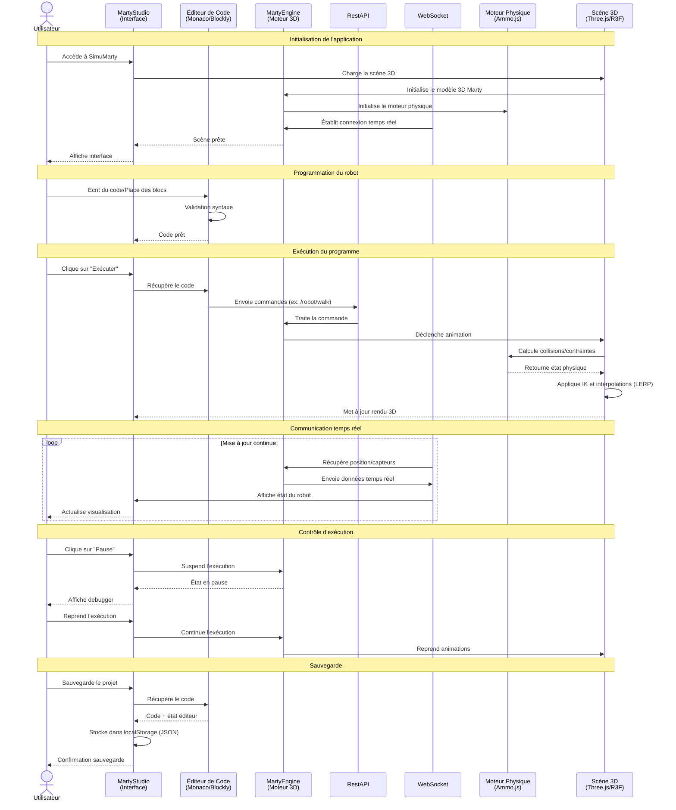

```mermaid
sequenceDiagram
    actor Utilisateur
    participant UI as MartyStudio<br/>(Interface)
    participant Editor as Éditeur de Code<br/>(Monaco/Blockly)
    participant Engine as MartyEngine<br/>(Moteur 3D)
    participant API as RestAPI
    participant WS as WebSocket
    participant Physics as Moteur Physique<br/>(Ammo.js)
    participant Scene as Scène 3D<br/>(Three.js/R3F)

    Note over Utilisateur,Scene: Initialisation de l'application
    Utilisateur->>UI: Accède à SimuMarty
    UI->>Scene: Charge la scène 3D
    Scene->>Engine: Initialise le modèle 3D Marty
    Engine->>Physics: Initialise le moteur physique
    WS->>Engine: Établit connexion temps réel
    Engine-->>UI: Scène prête
    UI-->>Utilisateur: Affiche interface

    Note over Utilisateur,Scene: Programmation du robot
    Utilisateur->>Editor: Écrit du code/Place des blocs
    Editor->>Editor: Validation syntaxe
    Editor-->>UI: Code prêt

    Note over Utilisateur,Scene: Exécution du programme
    Utilisateur->>UI: Clique sur "Exécuter"
    UI->>Editor: Récupère le code
    Editor->>API: Envoie commandes (ex: /robot/walk)
    API->>Engine: Traite la commande
    Engine->>Scene: Déclenche animation
    Scene->>Physics: Calcule collisions/contraintes
    Physics-->>Scene: Retourne état physique
    Scene->>Scene: Applique IK et interpolations (LERP)
    Scene-->>UI: Met à jour rendu 3D
    
    Note over Utilisateur,Scene: Communication temps réel
    loop Mise à jour continue
        WS->>Engine: Récupère position/capteurs
        Engine->>WS: Envoie données temps réel
        WS->>UI: Affiche état du robot
        UI-->>Utilisateur: Actualise visualisation
    end

    Note over Utilisateur,Scene: Contrôle d'exécution
    Utilisateur->>UI: Clique sur "Pause"
    UI->>Engine: Suspend l'exécution
    Engine-->>UI: État en pause
    UI-->>Utilisateur: Affiche debugger
    
    Utilisateur->>UI: Reprend l'exécution
    UI->>Engine: Continue l'exécution
    Engine->>Scene: Reprend animations

    Note over Utilisateur,Scene: Sauvegarde
    Utilisateur->>UI: Sauvegarde le projet
    UI->>Editor: Récupère le code
    Editor-->>UI: Code + état éditeur
    UI->>UI: Stocke dans localStorage (JSON)
    UI-->>Utilisateur: Confirmation sauvegarde
```